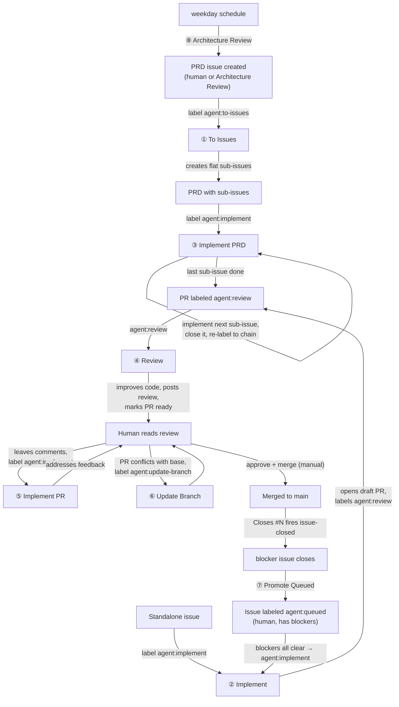
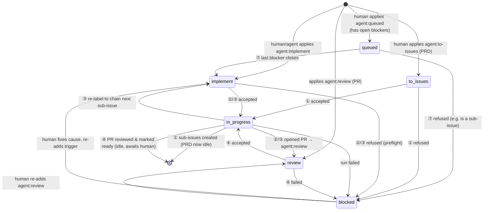

# GitHub-Native AFK Agent Platform — Implementation Spec

> **What this is.** A complete, implementable specification for an "away-from-keyboard"
> (AFK) agent platform built on GitHub. It lets you drive a fleet of autonomous coding
> agents entirely through **GitHub labels**: label an issue `agent:implement` and an
> agent opens a PR; label that PR `agent:review` and an agent reviews and improves it;
> close a blocker and a queued issue auto-promotes itself into the implement queue.
>
> This document is the source of truth. You should be able to re-implement the whole
> system in a fresh repository from this spec alone, without reading the original
> workflow YAML.

---

## 0. Fixed pillars and the one pluggable axis

The platform stands on four pillars. Three are **fixed** — the spec assumes them and
describes them concretely. One is **pluggable**.

| Pillar                               | Status                         | What the spec assumes                                                                                                                                                                                                                                                                                                                                                                                  |
| ------------------------------------ | ------------------------------ | ------------------------------------------------------------------------------------------------------------------------------------------------------------------------------------------------------------------------------------------------------------------------------------------------------------------------------------------------------------------------------------------------------ |
| **Orchestrator** — event/CI platform | **Fixed: GitHub Actions**      | Workflows triggered by `issues`, `pull_request_target`, and `schedule` events; per-job `permissions`; `concurrency` groups; `GITHUB_TOKEN` and a user-supplied `AGENT_PAT` secret.                                                                                                                                                                                                                     |
| **Tracker** — work-item store        | **Fixed: GitHub Issues + PRs** | Labels as state, native sub-issues, native issue dependency (blocking) relations, PR review threads with resolution state.                                                                                                                                                                                                                                                                             |
| **VCS**                              | **Fixed: git + GitHub**        | Branches, force-with-lease pushes, draft PRs, `Closes #N` auto-close.                                                                                                                                                                                                                                                                                                                                  |
| **Agent runner**                     | **Pluggable**                  | A process that is handed inputs (env vars + fetched context), does work in a git checkout, and writes **output files** to a directory. The reference implementation is [Sandcastle](https://github.com/ai-hero-dev/sandcastle) driving Claude Code, but any runner that honours the [Agent-Runner Contract](#38-the-agent-runner-contract) works (e.g. the Claude Agent SDK, or a hand-rolled script). |

**The central design rule:** the **orchestrator owns every tracker/VCS mutation** (labels,
comments, pushes, PR creation, issue closing). The **agent runner only emits files.** This
seam is what makes the runner swappable and the system testable — the agent never holds a
GitHub token and never calls the GitHub API to mutate state.

Throughout this spec:

- **"orchestrator"** means a GitHub Actions workflow.
- **"agent runner"** / **"the agent"** means the pluggable process described by the contract.
- Code blocks marked _reference_ show the Sandcastle/Claude Code implementation; treat them
  as one concrete realisation of an abstract requirement, not as a mandate.

---

## 1. The workflows at a glance

Eight workflows. Each gets a full section in [Part 4](#part-4--the-workflows).

| #   | Workflow                                               | Trigger                                          | One-line purpose                                                      |
| --- | ------------------------------------------------------ | ------------------------------------------------ | --------------------------------------------------------------------- |
| 1   | [To Issues](#41-to-issues)                             | issue labeled `agent:to-issues`                  | Decompose a PRD into a flat list of native sub-issues.                |
| 2   | [Implement (single issue)](#42-implement-single-issue) | issue labeled `agent:implement`                  | Implement one standalone issue and open a PR.                         |
| 3   | [Implement PRD](#43-implement-prd)                     | issue labeled `agent:implement` (has sub-issues) | Implement the next open sub-issue, chaining until the PRD is done.    |
| 4   | [Review](#44-review)                                   | PR labeled `agent:review`                        | Review and actively improve a PR; post a review + inline comments.    |
| 5   | [Implement PR](#45-implement-pr)                       | PR labeled `agent:implement`                     | Address unresolved reviewer feedback on a PR.                         |
| 6   | [Update Branch](#46-update-branch)                     | PR labeled `agent:update-branch`                 | Merge the base branch in, resolving conflicts (agent only if needed). |
| 7   | [Promote Queued](#47-promote-queued)                   | any issue **closed**                             | Promote `agent:queued` dependents whose blockers have all cleared.    |
| 8   | [Architecture Review](#48-architecture-review)         | daily `schedule`                                 | Propose one architectural-improvement PRD per weekday.                |

Workflows 2 and 3 share the **same trigger label** (`agent:implement` on an issue) and
disambiguate by issue _shape_ (does it have sub-issues?). See [§3.2](#32-the-label-state-machine).

---

## 2. End-to-end lifecycle



Two things this diagram encodes that are easy to miss:

1. **Nothing in the system merges to `main`.** A human approves and merges. The agents
   stop at "PR is ready for review." See [Non-Goals](#39-constraints-invariants--non-goals).
2. **The loop closes.** A merged PR's `Closes #N` closes the issue, which fires
   [Promote Queued](#47-promote-queued), which can unblock and auto-start the next issue.

### The per-item label state machine

Every issue/PR moves through this machine. Labels **are** the state; there is no external
database.



The labels in full are catalogued in [§3.2](#32-the-label-state-machine).

---

# Part 3 — Shared Foundations

Every workflow draws on these. The per-workflow sections reference them rather than
repeating them.

## 3.1 Prerequisites & setup

Before any workflow runs, the repository needs the following.

### Secrets

| Secret                  | Required?                | What it is                                                                                                                                                                                                  | Why                                                                                                                                                                                                                                                                                                                                     |
| ----------------------- | ------------------------ | ----------------------------------------------------------------------------------------------------------------------------------------------------------------------------------------------------------- | --------------------------------------------------------------------------------------------------------------------------------------------------------------------------------------------------------------------------------------------------------------------------------------------------------------------------------------- |
| `GITHUB_TOKEN`          | built-in                 | The automatic per-run token GitHub Actions injects.                                                                                                                                                         | Used for almost all tracker mutations.                                                                                                                                                                                                                                                                                                  |
| `AGENT_PAT`             | **strongly recommended** | A Personal Access Token (classic: `repo` + `workflow` scopes; or a fine-grained token with Contents, Issues, Pull requests = Read/Write, and Workflows = Read/Write) belonging to a human or a bot account. | Two reasons: **(a)** label adds via `GITHUB_TOKEN` **do not trigger downstream workflows** (GitHub suppresses recursive `GITHUB_TOKEN` events) — so chaining (`agent:implement` → implement run) requires a PAT; **(b)** pushing changes to files under `.github/workflows/` requires the `workflow` scope, which `GITHUB_TOKEN` lacks. |
| Agent-runner credential | **required**             | Whatever the chosen runner needs. _Reference:_ `ANTHROPIC_AUTH_TOKEN`,`ANTHROPIC_BASE_URL`,`ANTHROPIC_MODEL`.                                                                                                                                   | Authenticates the LLM/agent. The orchestrator passes it into the runner step only.                                                                                                                                                                                                                                                      |

If `AGENT_PAT` is **absent**, the platform still works but **degrades gracefully**: every
chain step that would auto-trigger the next workflow instead lands the label without firing
it, and a human must re-add the trigger label to continue. This fallback must be implemented
everywhere a label is added to trigger another workflow — see [§3.4](#34-downstream-triggering--graceful-degradation).

### Labels (pre-create all of these)

The state machine assumes these labels exist. Create them once.

| Label                        | Surface    | Meaning                                                                                                            |
| ---------------------------- | ---------- | ------------------------------------------------------------------------------------------------------------------ |
| `agent:to-issues`            | issue      | PRD is ready to be decomposed into sub-issues.                                                                     |
| `agent:implement`            | issue      | Ready for an implement run.                                                                                        |
| `agent:queued`               | issue      | Ready for agent work but waiting on declared blockers; auto-promotes. **Human-applied only.**                      |
| `agent:in-progress`          | issue + PR | A run is currently active. (Acts as a lock; see refusals.)                                                         |
| `agent:review`               | PR         | PR is ready for the automated review workflow.                                                                     |
| `agent:blocked`              | issue + PR | A run failed or was refused; needs human attention before retry.                                                   |
| `agent:update-branch`        | PR         | PR should be merged up to its base.                                                                                |
| `source:architecture-review` | issue      | Provenance: PRD was proposed by the Architecture Review workflow. (Created on demand by that workflow if missing.) |

### Per-workflow permissions matrix

Each workflow declares the **minimum** GitHub Actions `permissions` it needs:

| Workflow            | `contents` | `issues` | `pull-requests` |
| ------------------- | ---------- | -------- | --------------- |
| To Issues           | read       | write    | —               |
| Implement (single)  | write      | write    | write           |
| Implement PRD       | write      | write    | write           |
| Review              | write      | —        | write           |
| Implement PR        | write      | —        | write           |
| Update Branch       | write      | —        | write           |
| Promote Queued      | —          | write    | —               |
| Architecture Review | read       | write    | —               |

### Runner baseline

Every workflow that invokes the agent uses the same setup steps (adapt versions to your
project):

1. `actions/checkout@v4` (depth and `ref` vary per workflow — see each section).
2. `actions/setup-node@v4` with Node 22 (or your project's runtime).
3. `npm install` (install the project's own deps — agents run the project's typecheck/tests).
4. Install the agent runner. _Reference:_ `npm install -g @anthropic-ai/claude-code`.
5. Configure a git identity for any workflow that commits/pushes:
   `git config user.name "claude-code[bot]"` / `user.email "claude-code[bot]@users.noreply.github.com"`.

## 3.2 The label state machine

Labels encode all state. The invariant transitions, common to every workflow that acts on a
trigger label:

1. **On accept:** remove the trigger label, remove `agent:blocked`, add `agent:in-progress`.
2. **On success:** remove `agent:in-progress`; add the next label in the chain (or none).
3. **On failure:** add `agent:blocked` + a diagnostic comment; **always** remove
   `agent:in-progress` (an `always()`-style step).
4. **On refusal (preflight):** remove the trigger label, usually add `agent:blocked`, comment
   why; never enter `in-progress`.

`agent:in-progress` doubles as a **lock**: refusal preflights and the Promote-Queued
evaluator skip any item already `agent:in-progress`.

The two implement workflows (single-issue vs PRD) share the `agent:implement` trigger and are
**disambiguated by issue shape**, computed at the top of each run:

- **Has sub-issues** → it's a PRD → only [Implement PRD](#43-implement-prd) proceeds; the
  single-issue workflow silently skips.
- **No sub-issues, has a parent** → it's itself a sub-issue → both refuse (sub-issues are
  never labeled directly; label the parent PRD).
- **No sub-issues, no parent** → standalone issue → only [Implement (single)](#42-implement-single-issue) proceeds.

Shape is read via:

- **Sub-issues:** REST `GET repos/{owner}/{repo}/issues/{number}/sub_issues` → array (empty if none).
- **Parent:** GraphQL only (REST doesn't expose it):
  ```graphql
  query ($owner: String!, $repo: String!, $num: Int!) {
    repository(owner: $owner, name: $repo) {
      issue(number: $num) {
        parent {
          number
        }
      }
    }
  }
  ```

## 3.3 Trigger model

| Event                              | Used by                             | Notes                                                                 |
| ---------------------------------- | ----------------------------------- | --------------------------------------------------------------------- |
| `issues: [labeled]`                | To Issues, Implement, Implement PRD | Gate on `github.event.label.name == '<trigger>'`.                     |
| `issues: [closed]`                 | Promote Queued                      | Gate out wontfix: `github.event.issue.state_reason != 'not_planned'`. |
| `pull_request_target: [labeled]`   | Review, Implement PR, Update Branch | **Must be `pull_request_target`, not `pull_request`.**                |
| `schedule` (+ `workflow_dispatch`) | Architecture Review                 | Cron; `workflow_dispatch` lets you run it on demand.                  |

> **Why `pull_request_target` for PR-label workflows.** The ordinary `pull_request` trigger
> depends on a generated test-merge commit, which GitHub **fails to produce when the PR is
> out-of-date or conflicting** — which is exactly when Update Branch (and often Implement PR)
> needs to run. `pull_request_target` runs in the base-repo context and needs no merge commit,
> so the `labeled` event fires reliably. These workflows then explicitly check out
> `github.event.pull_request.head.sha` (see [§3.6](#36-push-safety)).

## 3.4 Downstream triggering & graceful degradation

GitHub deliberately **suppresses workflow triggers for events caused by `GITHUB_TOKEN`** to
prevent infinite loops. So any label add that is _meant_ to start another workflow must use
`AGENT_PAT`. The canonical pattern, used everywhere a chain hop happens:

```bash
# reference: add a trigger label that must fire a downstream workflow
set +e
if [ -n "$AGENT_PAT" ]; then
  GH_TOKEN="$AGENT_PAT" gh issue edit "$N" --add-label "agent:implement"
  status=$?
  if [ "$status" -eq 0 ]; then exit 0; fi
  echo "AGENT_PAT label add failed (status $status); falling back to GITHUB_TOKEN."
fi
GH_TOKEN="$GITHUB_TOKEN" gh issue edit "$N" --add-label "agent:implement"   # lands, won't trigger
```

Degradation contract: with no PAT (or a failing PAT), the label still lands — the _state_ is
correct — but the downstream workflow does not auto-start. A human re-adding the same label
(a `GITHUB_TOKEN`-external action) resumes the chain.

## 3.5 Concurrency model

| Group                                       | Members                             | Purpose                                                                                        |
| ------------------------------------------- | ----------------------------------- | ---------------------------------------------------------------------------------------------- |
| `agent-mutate-pr-${PR_NUMBER}`              | Review, Implement PR, Update Branch | All three push to the PR branch — serialise them so they never race each other on the same PR. |
| `agent-implement-prd-issue-${ISSUE_NUMBER}` | Implement PRD                       | One PRD chain at a time.                                                                       |
| `agent-implement-issue-${ISSUE_NUMBER}`     | Implement (single)                  | One run per issue.                                                                             |
| `agent-to-issues-prd-issue-${ISSUE_NUMBER}` | To Issues                           | One decomposition per PRD.                                                                     |
| `architecture-review`                       | Architecture Review                 | One daily pass at a time.                                                                      |
| _(none)_                                    | Promote Queued                      | Intentionally unguarded; uses an idempotent re-check instead — see [§4.7](#47-promote-queued). |

All groups set **`cancel-in-progress: false`** — an in-flight agent run is expensive and must
never be cancelled by a newer event; the new one waits.

## 3.6 Push safety

Workflows that let the agent commit and then push the branch protect against the branch
advancing underneath them (a human pushing, or a sibling workflow) using a **lease against
the SHA they checked out**:

```bash
# reference: race-safe push. BRANCH_HEAD_SHA = github.event.pull_request.head.sha
git push --force-with-lease="refs/heads/$BRANCH:$BRANCH_HEAD_SHA" origin "$BRANCH" 2> push_err.txt
# On rejection, classify:
if grep -qiE "non-fast-forward|rejected|fetch first|stale info" push_err.txt; then
  echo "Branch advanced during the run." > "$OUTPUT_DIR/failure_reason.txt"
  exit 1   # → marks blocked; a human/retry re-runs against the new head
fi
```

This both **detects races** (someone pushed during the run → fail cleanly, mark blocked) and
**tolerates history rewrites** (e.g. Update Branch's merge commit) when the remote is
unchanged. Per-workflow push nuances:

- **Implement (single):** `git push --force` (no lease). The branch name is deterministic
  from the issue number and the preflight guarantees no open PR targets the issue, so any
  pre-existing remote branch is a recoverable orphan — force-overwrite is safe and desirable.
- **Implement PRD:** plain `git push` (no force). The PRD branch **accumulates** commits
  across sub-issue runs; force would destroy earlier sub-issues' work.
- **Review / Implement PR / Update Branch:** `--force-with-lease` against the checked-out
  head SHA (above).

## 3.7 Failure handling

Uniform across all agent-invoking workflows:

1. The agent runner writes a human-readable reason to `${OUTPUT_DIR}/failure_reason.txt`
   before exiting non-zero. (Orchestrator falls back to `"(no reason file written — check
workflow logs)"` if absent.)
2. A `failure()`-conditioned step adds `agent:blocked`, then comments on the issue/PR with the
   reason and a link to the workflow run, and instructions to retry (re-add the trigger label).
3. An `always()`-conditioned step removes `agent:in-progress`, so a crashed run never leaves a
   stuck lock.

Reference failure comment shape:

```
`agent:<trigger>` run failed.

**Reason:** <failure_reason.txt or fallback>

**Workflow run:** <server_url>/<repo>/actions/runs/<run_id>

Re-add `agent:<trigger>` to retry.
```

## 3.8 The agent-runner contract

This is the seam that makes the runner pluggable. **Inputs in via env vars; outputs out via
files in a directory; the orchestrator does all GitHub mutations.**

### Inputs

- **Environment variables** chosen by each workflow (e.g. `ISSUE_NUMBER`, `PR_NUMBER`,
  `BRANCH`, `BASE_REF`, `SUB_ISSUE_NUMBER`, and `OUTPUT_DIR`).
- **Pre-fetched context.** For PR workflows the orchestrator's _runner script_ fetches the
  diff, the issue, and the PR conversation, and feeds them to the agent's prompt. The agent
  may also call read-only `gh`/`git` itself. (In the reference, prompts embed
  `` !`gh issue view …` `` / `` !`git diff main..HEAD` `` command-substitutions and a
  pre-serialised `PR_COMMENTS_JSON`.)
- **A git working tree** checked out on the correct branch.

### Outputs (files in `OUTPUT_DIR`)

The runner writes well-known files; the orchestrator reads them in subsequent steps. Two
kinds:

**Plain-text convention files**

| File                                 | Written by              | Consumed for                                       |
| ------------------------------------ | ----------------------- | -------------------------------------------------- |
| `failure_reason.txt`                 | any (on failure)        | the blocked comment ([§3.7](#37-failure-handling)) |
| `has_commits.txt`                    | Implement PR            | `"true"`/`"false"` — whether to push               |
| `should_push.txt`                    | Update Branch           | `"true"`/`"false"` — whether to push               |
| `pr_title.txt`, `pr_description.txt` | write-pr / write-prd-pr | `gh pr create --title/--body-file`                 |
| `comment.md`                         | Update Branch           | body for `gh pr comment`                           |
| `summary.md`, `verdict.txt`          | Review                  | logging/diagnostics                                |

**Structured JSON files** (each validated against a schema — see per-workflow contracts).
Examples: `review_payload.json`, `replies.json`, `implement_thread_replies.json`,
`implement_new_inline_comments.json`, `implement_top_level_comments.json`,
`architecture_review_output.json`.

### Output reliability: produce vs. extract

Asking one LLM turn to _both do the work and emit rigid JSON_ is brittle — a malformed blob
fails the whole run, including its side effects. The reference runner offers two helpers; an
implementer should reproduce the **behaviour**, not necessarily the code:

- **`runWithRetry` (single pass).** For **side-effect-free** tasks where the output _is_ the
  work (drafting a PR title/description, breaking a PRD into slices). Run the prompt with the
  output schema attached; on a schema-validation failure, **resume the same session** with
  feedback describing exactly what was wrong, up to N attempts (default 3). Nothing is re-done;
  the agent only re-emits.
- **`runWithExtraction` (two passes).** For tasks with **side effects we must not repeat**
  (commits, comments). **Produce:** run the work prompt with _no_ output schema, so a bad emit
  can't abort it; keep the resumable session id. **Extract:** resume that session with a
  separate "emit `<output>` now, change nothing" prompt + the schema, retried like
  `runWithRetry`. Commits come from the produce pass; structured output from the extract pass.

### Input tolerance (hard-won robustness)

Inline-comment schemas accept aliases and coerce, because models drift:

- Accept `path` **or** `file`; accept `body` **or** `comment`.
- Accept a single `line` (integer) **or** a `lineRange` string, from which the leading integer
  is parsed.
- `side` defaults to `RIGHT`.
- After parsing, the orchestrator's script **drops** any inline comment whose `path`+`line`
  isn't present in the actual diff hunks (hallucinated anchors), and any thread reply whose
  `commentId` wasn't in the fetched threads. (Diff hunks are parsed from `git diff main...HEAD`.)

_Reference note:_ schemas are expressed with Zod in TypeScript. This spec states them
language-neutrally as `field: type` shapes; reproduce the validation and the tolerance, in any
language.

## 3.9 Constraints, invariants & non-goals

Tag each as a **hard invariant** (break it and the system misbehaves) or a **v1 scoping
choice** (safe to extend later). Do not "fix" the invariants.

**Hard invariants**

- **One issue → one branch → one PR.** Branch names are deterministic
  (`agent/issue-<n>-<slug>`, `agent/prd-<n>-<slug>`). The interplay between this and the push
  strategy ([§3.6](#36-push-safety)) is what makes orphan recovery and PRD accumulation safe.
- **The agent never mutates the tracker/VCS remote.** It commits locally and writes files; the
  orchestrator pushes, comments, labels, closes. This holds universally — even Architecture
  Review only _emits_ a PRD as structured output; the orchestrator creates the issue.
- **`agent:in-progress` is a lock.** Adding it is part of "accept"; removing it is `always()`.
- **The agent can't resolve review threads.** Resolution is the reviewer's (human's) job; the
  agent only replies.
- **Nothing auto-merges to the base branch.** (See non-goals.)

**v1 scoping choices**

- **Flat PRDs only.** A PRD's sub-issues must be leaves: a PRD that is itself a sub-issue is
  refused (nested PRD), and a sub-issue that has its own sub-issues is refused (nested child).
- **`agent:queued` is human-applied only.** Promote Queued is the _exit ramp_, not the
  entrance. There is no guard that auto-downgrades a wrongly-applied `agent:implement` on a
  blocked issue — if you mislabel, the run happens and likely fails.
- **One sub-issue per PRD run**, then re-label to chain the next.
- **To Issues only runs on a PRD with zero existing sub-issues.**

**Non-goals**

- **No auto-merge / no approval.** Review marks a PR _ready for review_ and posts a review with
  `event: "COMMENT"` — never `APPROVE`. A human approves and merges.
- **No cross-repo orchestration.** Single repository.
- **No prose-based dependency parsing.** Blockers come only from GitHub's native dependency
  relation, never from "Blocked by #N" text. The sub-issue/parent relation is _not_ a blocking
  relation.

---

# Part 4 — The workflows

Each section follows the same anatomy: **Purpose · Trigger · Concurrency · Permissions ·
Preconditions & refusals · Step sequence · Agent-runner contract · Side-effects · Failure
handling · Chaining.** Where a concern is fully covered by Part 3, the section links to it.

---

## 4.1 To Issues

**Purpose.** Decompose a PRD issue into a flat, ordered list of native GitHub sub-issues, each
a tracer-bullet vertical slice. The agent drafts the plan; the **orchestrator creates and
attaches** the sub-issues deterministically.

**Trigger.** `issues: [labeled]`, gated on label `agent:to-issues`.
**Concurrency.** `agent-to-issues-prd-issue-${ISSUE_NUMBER}`, no cancel.
**Permissions.** `contents: read`, `issues: write`.

**Preconditions & refusals.** Compute shape ([§3.2](#32-the-label-state-machine)); then:

| Condition                          | Mode   | Action                                                                                      |
| ---------------------------------- | ------ | ------------------------------------------------------------------------------------------- |
| Already has ≥1 sub-issue           | refuse | remove trigger, add `agent:blocked`, comment "already has N sub-issues; detach them first". |
| Is itself a sub-issue (has parent) | refuse | remove trigger, add `agent:blocked`, comment "nested PRDs not supported; flatten".          |
| Otherwise                          | run    | proceed.                                                                                    |

**Step sequence (run mode).**

1. Transition labels: remove `agent:to-issues` + `agent:blocked`, add `agent:in-progress`.
2. Checkout `main` (`fetch-depth: 1`); Node + deps + agent runner.
3. Run the **to-issues** agent (env: `PRD_NUMBER`, `PRD_TITLE`, `GH_REPO`).
4. For each slice in the agent's output, in order: create the issue, then attach it as a
   sub-issue (see contract).
5. `always()`: remove `agent:in-progress`.

**Agent-runner contract.**

- _Inputs:_ `PRD_NUMBER`, `PRD_TITLE`, `GH_REPO`. The agent fetches the PRD with
  `gh issue view`, reads `CONTEXT.md`/ADRs, optionally explores the codebase. Read-only —
  it creates nothing.
- _Output:_ this task is side-effect-free, so use the **single-pass** strategy
  (`runWithRetry`). Schema:
  ```
  {
    slices: Array<{                      // ordered; list order == execution order
      title: string (1..200),            // imperative, no "feat:" prefix
      whatToBuild: string (non-empty),   // prose, no file paths
      acceptanceCriteria: string[] (>=1) // rendered as a GitHub checklist
    }> (min 1)
  }
  ```
- _Orchestrator-side creation (per slice):_

  ```bash
  # 1. create the issue with a rendered body (see below); capture its number from the URL
  url=$(gh issue create --title "$TITLE" --body "$BODY")          # body has no "Closes"
  sub_number=$(basename "$url")
  # 2. resolve the new issue's GraphQL/REST node id, then attach as a native sub-issue
  sub_id=$(gh api "repos/$GH_REPO/issues/$sub_number" --jq .id)   # numeric id
  gh api -X POST "repos/$GH_REPO/issues/$PRD_NUMBER/sub_issues" -F "sub_issue_id=$sub_id"
  ```

  Rendered sub-issue body:

  ```markdown
  ## Parent PRD

  #<PRD_NUMBER>

  ## What to build

  <whatToBuild>

  ## Acceptance criteria

  - [ ] <criterion 1>
  - [ ] <criterion 2>
  ```

  **No `Closes` directive** in sub-issue bodies — closing sub-issues is Implement PRD's job;
  closing the PRD is the merged PR's job.

**Side-effects.** Creates N sub-issues, attached to the PRD via the native relation.

**Failure handling.** Per [§3.7](#37-failure-handling); the blocked comment additionally lists
the sub-issues **already created before** the failure (so a human can clean up partial state):
`gh api repos/$GH_REPO/issues/$PRD/sub_issues --jq '[.[]|"#\(.number)"]|join(", ")'`.

**Chaining.** None automatic. A human reviews the sub-issues, then labels the PRD
`agent:implement` to start [Implement PRD](#43-implement-prd).

**Prompt skeleton:** [`prompts/to-issues.prompt.md`](./prompts/to-issues.prompt.md).

---

## 4.2 Implement (single issue)

**Purpose.** Implement one standalone issue end-to-end on a fresh branch and open a draft PR.

**Trigger.** `issues: [labeled]`, gated on `agent:implement`.
**Concurrency.** `agent-implement-issue-${ISSUE_NUMBER}`, no cancel.
**Permissions.** `contents: write`, `issues: write`, `pull-requests: write`.

**Preconditions & refusals.** Compute shape, then:

| Condition                             | Action                                                                                                                                                                      |
| ------------------------------------- | --------------------------------------------------------------------------------------------------------------------------------------------------------------------------- | ----- | ------------------ |
| Has sub-issues (is a PRD)             | **Silent skip** — [Implement PRD](#43-implement-prd) owns this trigger for PRDs.                                                                                            |
| Is a sub-issue (has parent)           | **Refuse:** remove trigger, add `agent:blocked`, comment "label the parent PRD, not the sub-issue".                                                                         |
| An open PR already targets this issue | **Refuse:** remove trigger, comment with the existing PR URL, exit. Detect via `gh pr list --state open --search "in:body \"#N\""` then filter bodies matching `(?i)(closes | fixes | resolves)\s+#N\b`. |
| Otherwise                             | Run.                                                                                                                                                                        |

**Step sequence.**

1. Transition labels: remove `agent:implement` + `agent:blocked`, add `agent:in-progress`.
2. Checkout `main` (`fetch-depth: 0`) with `AGENT_PAT || GITHUB_TOKEN` (PAT lets the push
   include `.github/workflows/**` changes).
3. Compute branch: `agent/issue-<n>-<slug>` where slug = lowercased title, non-alphanumerics →
   `-`, trimmed, cut to 50 chars. Create it.
4. Node + deps + agent runner; git identity.
5. Run the **implement** agent (env: `ISSUE_NUMBER`, `ISSUE_TITLE`, `BRANCH`, `OUTPUT_DIR`).
6. `git push --force origin "$BRANCH"` (see [§3.6](#36-push-safety) for why force is safe here).
7. Run the **write-pr** agent → `pr_title.txt` + `pr_description.txt`.
8. Open a **draft** PR: `gh pr create --draft --base main --head "$BRANCH" --title <title,
capped 256> --body-file pr_description.txt`; capture PR number.
9. Add `agent:review` to the PR (using the [PAT-or-fallback pattern](#34-downstream-triggering--graceful-degradation)) to trigger [Review](#44-review).
10. `always()`: remove `agent:in-progress`.

**Agent-runner contract.**

- **implement agent.** _Inputs:_ `ISSUE_NUMBER`, `ISSUE_TITLE`, `BRANCH`. Does TDD work,
  commits to `BRANCH` with conventional-commit messages, **does not push, does not close the
  issue.** _Output:_ none structured. The orchestrator's script asserts **at least one commit**
  exists (`git rev-list --count main..HEAD > 0`); zero commits → write `failure_reason.txt`,
  exit 1.
- **write-pr agent.** Side-effect-free → single-pass (`runWithRetry`). _Inputs:_
  `ISSUE_NUMBER`, `ISSUE_TITLE`, `BRANCH`. _Output schema:_
  ```
  { prTitle: string (1..256), prDescription: string (non-empty) }   // description must contain "Closes #<n>"
  ```
  Written to `pr_title.txt` / `pr_description.txt`.

**Side-effects.** New branch, commits, a draft PR labeled `agent:review`.

**Failure handling.** [§3.7](#37-failure-handling).

**Chaining.** → [Review](#44-review) via `agent:review` on the new PR.

**Prompt skeletons:** [`prompts/implement.prompt.md`](./prompts/implement.prompt.md),
[`prompts/write-pr.prompt.md`](./prompts/write-pr.prompt.md).

---

## 4.3 Implement PRD

**Purpose.** Implement a PRD as a **chain** of single-sub-issue runs, all committing to one
shared branch, opening (and reusing) one PR, until every sub-issue is closed.

**Trigger.** `issues: [labeled]`, gated on `agent:implement` (proceeds only when the issue has
sub-issues).
**Concurrency.** `agent-implement-prd-issue-${ISSUE_NUMBER}`, no cancel.
**Permissions.** `contents: write`, `issues: write`, `pull-requests: write`.

**Preconditions & refusals.** Compute a richer shape (sub-issues + parent + per-child shape):

| Condition                            | Mode                  | Action                                                                  |
| ------------------------------------ | --------------------- | ----------------------------------------------------------------------- |
| No sub-issues                        | `silent`              | Not a PRD; [Implement (single)](#42-implement-single-issue) handles it. |
| Has sub-issues **and** has a parent  | `refuse-nested-prd`   | blocked + comment "flatten".                                            |
| Any sub-issue has its own sub-issues | `refuse-nested-child` | blocked + comment naming the offending child.                           |
| All sub-issues already closed        | `refuse-all-closed`   | blocked + comment "nothing to implement".                               |
| Otherwise                            | `run`                 | target = first still-open sub-issue, in sub-issue API order.            |

**Step sequence (run mode).**

1. Transition the PRD: remove `agent:implement` + `agent:blocked`, add `agent:in-progress`.
2. Compute branch `agent/prd-<n>-<slug>`.
3. Checkout `main` (`fetch-depth: 0`, `AGENT_PAT || GITHUB_TOKEN`). **Resume or create** the
   branch: if `origin/<branch>` exists, `git checkout -B <branch> origin/<branch>` (`is_first=false`);
   else `git checkout -b <branch>` (`is_first=true`).
4. Node + deps + agent runner.
5. Run the **implement-prd** agent (env adds `SUB_ISSUE_NUMBER`, `SUB_ISSUE_TITLE`). **No
   commit assertion** — a sub-issue may already be satisfied by earlier work, and zero new
   commits is legitimate; the run must still proceed to close it and advance.
6. `git push origin "$BRANCH"` — **plain push, never force** (the branch accumulates).
7. Close the completed sub-issue: `gh issue close $SUB --comment "Implemented in <sha>. Part of #$PRD."`.
8. Look up an existing open PR for the branch (`gh pr list --head "$BRANCH" --state open`).
9. **Only if no PR exists yet:** run the **write-prd-pr** agent → title/description framed
   around the _whole PRD_; open a draft PR.
10. Re-check remaining open sub-issues.
    - **>0 remaining:** re-add `agent:implement` to the **PRD** (PAT-or-fallback) → re-fires
      this workflow for the next sub-issue (**the chain**).
    - **0 remaining:** add `agent:review` to the PR → hand off to [Review](#44-review).
11. `always()`: remove `agent:in-progress` from the PRD.

**Agent-runner contract.**

- **implement-prd agent.** _Inputs:_ `PRD_NUMBER`, `PRD_TITLE`, `SUB_ISSUE_NUMBER`,
  `SUB_ISSUE_TITLE`, `BRANCH`. Implements **only** the named sub-issue; must **not** rebase or
  rewrite existing branch history; commits include `Part of #<PRD>` and **no `Closes`**; does
  not push or close. _Output:_ none structured.
- **write-prd-pr agent.** Single-pass; same output schema as write-pr, but the description
  describes the whole PRD, lists every sub-issue, and ends with `Closes #<PRD>`.

**Side-effects.** Commits on the shared branch; one sub-issue closed per run; one draft PR
created then reused; chain re-label or review hand-off.

**Failure handling.** Per [§3.7](#37-failure-handling), keyed to the sub-issue being
implemented; comments on **both** the PRD and the sub-issue. Retry = remove `agent:blocked` +
re-add `agent:implement`; the run recomputes the first open sub-issue, so it resumes where it
stopped.

**Chaining.** Self (next sub-issue) **or** → [Review](#44-review).

**Prompt skeletons:** [`prompts/implement-prd.prompt.md`](./prompts/implement-prd.prompt.md),
[`prompts/write-prd-pr.prompt.md`](./prompts/write-prd-pr.prompt.md).

---

## 4.4 Review

**Purpose.** Review a PR against its linked issue (the spec) and coding standards — and
**actively improve the code**, not just comment. Posts a single PR review (summary + inline
comments), replies to unresolved human threads, and marks the PR ready for review.

**Trigger.** `pull_request_target: [labeled]`, gated on `agent:review`.
**Concurrency.** `agent-mutate-pr-${PR_NUMBER}`, no cancel (shared with Implement PR + Update Branch).
**Permissions.** `contents: write`, `pull-requests: write`.

**Preconditions & refusals.** None — labeling implies intent. (It transitions straight to
in-progress.)

**Step sequence.**

1. Transition labels: remove `agent:review` + `agent:blocked`, add `agent:in-progress`.
2. Checkout `github.event.pull_request.head.sha` (`fetch-depth: 0`); `git fetch origin main:main`;
   check out the branch by name. Capture pre-run HEAD.
3. Node + deps + agent runner; git identity.
4. **Orchestrator's runner script fetches PR context** (see contract) and runs the **review**
   agent.
5. Race-safe push ([§3.6](#36-push-safety)) — pushes the agent's improvement commit if any.
6. Post the review: `POST repos/{owner}/{repo}/pulls/{PR}/reviews` with `review_payload.json`.
7. `gh pr ready "$PR"` (un-draft).
8. Post thread replies (see "node-id → REST id" below).
9. `always()`: remove `agent:in-progress`.

**Agent-runner contract.**

- _Inputs:_ `PR_NUMBER`, `BRANCH`, `OUTPUT_DIR`, plus context the runner script pre-fetches:
  - linked issue number (parsed from the PR body via `(?i)(closes|fixes|resolves)\s+#(\d+)`)
    and its title;
  - the diff (`git diff main..HEAD`);
  - a `PR_COMMENTS_JSON` bundle with three surfaces: `issue_comments` (top-level),
    `review_summaries` (submitted-review bodies), and `review_threads` (unresolved inline
    threads, each comment carrying its GraphQL `commentId`). Unresolved threads come from:
    ```graphql
    query ($owner: String!, $repo: String!, $number: Int!) {
      repository(owner: $owner, name: $repo) {
        pullRequest(number: $number) {
          reviewThreads(first: 100) {
            nodes {
              id
              isResolved
              isOutdated
              comments(first: 50) {
                nodes {
                  id
                  path
                  line
                  originalLine
                  body
                  author {
                    login
                  }
                }
              }
            }
          }
        }
      }
    }
    ```
    Filter to `isResolved == false`.
- _Behaviour:_ the agent improves the code on the branch (single squashed commit; reference
  message prefix `RALPH: Review -`), runs typecheck/tests, and decides per human comment to
  **Address / Decline / Defer**. It **cannot** resolve threads. If the code is already clean
  and there's nothing to answer, it makes no commit.
- _Output:_ side-effecting (commits + comments) → **two-pass** (`runWithExtraction`). Schema:
  ```
  {
    summary: string (non-empty),            // 1-3 paragraphs; explain even a clean review
    inlineComments: Array<{ path; line:int; body }>,   // alias/coerce per §3.8
    replies: Array<{ commentId; body }>     // commentId must be from a shown review_thread
  }
  ```
- _Orchestrator-side validation:_ drop inline comments whose `path:line` isn't in the diff
  hunks; drop replies whose `commentId` wasn't fetched. Build `review_payload.json`:
  ```
  { commit_id: <HEAD sha>, event: "COMMENT", body: <summary>,
    comments: [ { path, line, side: "RIGHT", body } ] }
  ```
  Also writes `replies.json`, `summary.md`, and `verdict.txt` (`"improved"` if the agent
  committed, else `"clean"`).

> **Posting a thread reply requires a REST id, but the agent only has the GraphQL node id.**
> Resolve it first, then POST:
>
> ```bash
> rest_id=$(gh api graphql -f query='query($id:ID!){node(id:$id){... on PullRequestReviewComment{databaseId}}}' -F id="$commentId" --jq '.data.node.databaseId')
> gh api -X POST "repos/{owner}/{repo}/pulls/$PR/comments/$rest_id/replies" -f body="$body"
> ```

**Side-effects.** Optional improvement commit (pushed), one PR review, in-thread replies, PR
marked ready.

**Failure handling.** [§3.7](#37-failure-handling). A race-detected push failure writes its own
`failure_reason.txt` ("Branch advanced during review run.").

**Chaining.** None automatic — hands back to a human.

**Prompt skeleton:** [`prompts/review.prompt.md`](./prompts/review.prompt.md).

---

## 4.5 Implement PR

**Purpose.** Address **unresolved reviewer feedback** on a PR: read the conversation, change
code where warranted, and reply where a reply adds value. (Unlike Review, it does _not_
re-audit against the spec — it acts on the conversation.)

**Trigger.** `pull_request_target: [labeled]`, gated on `agent:implement` (on a **PR**).
**Concurrency.** `agent-mutate-pr-${PR_NUMBER}`, no cancel.
**Permissions.** `contents: write`, `pull-requests: write`.

**Preconditions & refusals.**

| Condition                                                                                           | Action                                                                                                                                                                                  |
| --------------------------------------------------------------------------------------------------- | --------------------------------------------------------------------------------------------------------------------------------------------------------------------------------------- |
| PR is closed or merged                                                                              | Refuse: remove trigger, comment "PR is not open", stop.                                                                                                                                 |
| Nothing to act on (no top-level comments **and** no review summaries **and** no unresolved threads) | Refuse: remove trigger, comment "nothing to act on", stop. Counts come from `gh pr view --json comments`, the reviews API (non-empty bodies), and the unresolved-threads GraphQL query. |
| Otherwise                                                                                           | Run.                                                                                                                                                                                    |

**Step sequence.**

1. Refusal preflights (above). If proceeding: remove `agent:implement` + `agent:blocked`, add
   `agent:in-progress`.
2. Checkout head SHA (`fetch-depth: 0`, `AGENT_PAT || GITHUB_TOKEN`); ensure `main` available;
   check out branch by name. Node + deps + agent runner; git identity.
3. Run the **implement-pr** agent (same fetched-context bundle as Review).
4. Push **only if** `has_commits.txt == "true"`, race-safe ([§3.6](#36-push-safety)).
5. Post thread replies (node-id → REST id, as in Review).
6. Post new inline comments: `POST .../pulls/{PR}/comments` with `commit_id`, `path`, `line`,
   `side`, `body` from `implement_new_inline_comments.json`.
7. Post top-level comments via `gh pr comment` from `implement_top_level_comments.json`.
8. `always()`: remove `agent:in-progress`.

**Agent-runner contract.**

- _Inputs:_ identical to Review (`PR_NUMBER`, `BRANCH`, linked issue, diff, `PR_COMMENTS_JSON`).
- _Behaviour:_ classify each item as change-needed / reply-needed / neither; make the changes;
  reply only where useful (don't reply to context-only comments); can't resolve threads. Run
  typecheck/tests before committing; conventional commits, **no `RALPH:` prefix**.
- _Output:_ side-effecting → **two-pass** (`runWithExtraction`). Schema:
  ```
  {
    threadReplies:     Array<{ commentId; body }>,
    newInlineComments: Array<{ path; line:int; side="RIGHT"; body }>,  // alias/coerce per §3.8
    topLevelComments:  Array<{ body }>
  }
  ```
- _Orchestrator-side:_ validate/drop as in Review; write the three JSON files plus
  `has_commits.txt`. **Degenerate-run guard:** if there are **zero commits and all three reply
  arrays are empty**, write `failure_reason.txt` and fail — nothing happened.

**Side-effects.** Optional commit (pushed if present), in-thread replies, new inline comments,
top-level comments.

**Failure handling.** [§3.7](#37-failure-handling).

**Chaining.** None automatic — hands back to a human (who may re-review or merge).

**Prompt skeleton:** [`prompts/implement-pr.prompt.md`](./prompts/implement-pr.prompt.md).

---

## 4.6 Update Branch

**Purpose.** Bring a PR branch up to date with its base. The **orchestrator does the
deterministic merge first**; the agent is invoked **only when there are conflicts**.

**Trigger.** `pull_request_target: [labeled]`, gated on `agent:update-branch`.
**Concurrency.** `agent-mutate-pr-${PR_NUMBER}`, no cancel.
**Permissions.** `contents: write`, `pull-requests: write`.

**Preconditions & refusals.** None at the workflow level; the runner script itself short-circuits
(see below).

**Step sequence.**

1. Transition labels: remove `agent:update-branch` + `agent:blocked`, add `agent:in-progress`.
2. Checkout head SHA (`fetch-depth: 0`); check out branch by name. Node + deps + agent runner;
   git identity.
3. Run the **update-branch** runner script (env: `PR_NUMBER`, `BRANCH`, `BASE_REF`,
   `OUTPUT_DIR`). Its internal logic:
   - `git fetch origin $BASE_REF`. If already up to date (`merge-base == base sha`):
     write `comment.md` ("already up to date"), `should_push.txt=false`, exit 0 — **agent never
     runs**.
   - Else `git merge origin/$BASE_REF --no-edit`. **Clean merge:** write a "merged cleanly"
     `comment.md`, `should_push.txt=true`, exit 0 — **agent never runs**.
   - **Conflicts:** invoke the agent to resolve, then assert it produced a commit and left **no
     unresolved files** (`git diff --name-only --diff-filter=U` empty); write the agent's
     `comment.md`, `should_push.txt=true`.
4. Push **only if** `should_push.txt == "true"`, race-safe — the lease tolerates the rewritten
   history of a merge as long as the remote head is unchanged.
5. Post `comment.md` (if present) via `gh pr comment`.
6. `always()`: remove `agent:in-progress`.

**Agent-runner contract (conflict path only).**

- _Inputs:_ `PR_NUMBER`, `BRANCH`, `BASE_REF`. Context: `gh pr view`, `git status`, and the
  conflicting file list are embedded in the prompt. The working tree is **already in the
  conflicted state** (the merge has been attempted).
- _Behaviour:_ resolve every conflict preserving both intents where possible; never abort the
  merge; don't invent new behaviour; finish with a single merge commit; run checks it deems
  warranted.
- _Output:_ side-effecting → **two-pass** (`runWithExtraction`). Schema:
  ```
  { comment: string (non-empty) }   // PR comment: what conflicted, how resolved, any uncertainty
  ```

**Side-effects.** A merge commit pushed to the branch; a PR comment describing the merge.

**Failure handling.** [§3.7](#37-failure-handling). The runner fails (writes `failure_reason.txt`)
if the agent left unresolved conflicts or produced no commit.

**Chaining.** None automatic.

**Prompt skeleton:** [`prompts/update-branch.prompt.md`](./prompts/update-branch.prompt.md).

---

## 4.7 Promote Queued

**Purpose.** When an issue closes, promote any `agent:queued` issue that declared it as a
blocker — but only once **all** that dependent's blockers have cleared — by flipping it to
`agent:implement`. This is the **exit ramp** from the queued state; humans apply
`agent:queued`, this workflow removes it.

**Trigger.** `issues: [closed]`, gated on `github.event.issue.state_reason != 'not_planned'`
(a wontfix close doesn't unblock anything).
**Concurrency.** **None by design** — parallel runs are made safe by an idempotent re-check
(below).
**Permissions.** `issues: write`.
**Timeout.** Short (≈5 min); it makes no agent calls.

**Step sequence.**

1. **Find dependents** of the closed issue `X` — issues that declared `X` as a blocker — via the
   native dependency relation's `blocking` connection:
   ```graphql
   query ($owner: String!, $repo: String!, $num: Int!) {
     repository(owner: $owner, name: $repo) {
       issue(number: $num) {
         blocking(first: 100) {
           nodes {
             number
             state
           }
         }
       }
     }
   }
   ```
   Keep the `OPEN` ones.
2. **For each dependent `Y`,** fetch labels + parent + `blockedBy` in one GraphQL call and
   decide:

   | `Y`'s state                                  | Action                                                                                          |
   | -------------------------------------------- | ----------------------------------------------------------------------------------------------- |
   | Not labeled `agent:queued`                   | Silent skip.                                                                                    |
   | Labeled `agent:in-progress`                  | Silent skip (a run is already going).                                                           |
   | Is a sub-issue (has parent)                  | **Refuse:** remove `agent:queued`, add `agent:blocked`, comment "label the parent PRD instead". |
   | Still has ≥1 open blocker (`blockedBy` OPEN) | Silent skip (no comment — the GitHub UI already shows remaining blockers).                      |
   | No open blockers, still `agent:queued`       | **Promote** (next step).                                                                        |

3. **Idempotent flip** (race protection): immediately **re-fetch** `Y`'s labels; if
   `agent:queued` is already gone (a sibling run won), silently skip. Otherwise: remove
   `agent:queued`, comment "Unblocked by #X closing — promoting…", and add `agent:implement`
   using the [PAT-or-fallback pattern](#34-downstream-triggering--graceful-degradation).

**Why no concurrency group.** Two blockers closing within seconds fire two parallel runs.
Rather than serialise (which would delay promotions), the re-fetch-before-mutate in step 3
makes a double-promotion a no-op, and the downstream [Implement](#42-implement-single-issue)
preflight (refuses if an open PR exists) catches any duplicate trigger.

**Agent-runner contract.** None — this workflow invokes no agent.

**Side-effects.** For each promotable dependent: `agent:queued` → `agent:implement` (+ comment).

**Failure handling.** No blocked-labeling flow; it's a fast, idempotent label shuffle. Failures
surface in the run log.

**Chaining.** → [Implement](#42-implement-single-issue) (or [Implement PRD](#43-implement-prd)
if the promoted issue is a PRD) via the promoted `agent:implement`.

---

## 4.8 Architecture Review

**Purpose.** A scheduled, unattended pass that surveys the codebase, picks **one** high-leverage
architectural-improvement opportunity not already proposed, and publishes it as a PRD-shaped
issue — ready to be fed to [To Issues](#41-to-issues).

**Trigger.** `schedule` (reference cron `0 9 * * 1-5` = 09:00 UTC weekdays) + `workflow_dispatch`.
**Concurrency.** `architecture-review`, no cancel.
**Permissions.** `contents: read`, `issues: write`.
**Timeout.** ≈20 min.

**Step sequence.**

1. Checkout `main` (`fetch-depth: 1`); Node + deps + agent runner.
2. Run the **architecture-review** agent (env: `OUTPUT_DIR`) → `architecture_review_output.json`
   (+ `prd_title.txt` / `prd_body.md` when it proposes).
3. **Publish** (only if `status == "proposed"`): ensure the provenance label exists
   (`gh label create source:architecture-review --color 5319E7 --description ... || true`), then
   `gh issue create --title <title> --body-file prd_body.md --label source:architecture-review`.
4. `always()`: write a run summary to the job summary (created PRD link + candidates considered,
   or the skip reason).

**Agent-runner contract.**

- _Inputs:_ `OUTPUT_DIR`. The agent reads `CONTEXT.md` + ADRs (binding — must not contradict a
  recorded decision), lists prior `source:architecture-review` proposals (open and closed) to
  avoid duplicates, explores, and picks one candidate. It is **fully read-only on the repo and
  the tracker** — it makes no commits and creates nothing. It only _drafts_ the PRD (title +
  full body) and emits it as structured output. **The orchestrator is the sole publisher** (step
  3 above), so there is exactly one publication path. The PRD body the agent emits must be a
  complete spec, ready for [To Issues](#41-to-issues) to decompose — see the body template
  inlined in the [prompt skeleton](./prompts/architecture-review.prompt.md).
- _Output:_ two-pass (`runWithExtraction`). **Discriminated union** on `status`:
  ```
  // proposed:
  { status: "proposed", title: string (1..256), body: string,
    oneLineSummary: string, candidatesConsidered: string[] (>=1) }
  // skipped (everything fresh already covered):
  { status: "skipped", reason: string }
  ```

**Side-effects.** At most one new PRD issue per run, labeled `source:architecture-review`.

**Failure handling.** No blocked flow (no issue/PR to label). If no output file is produced the
summary step notes the agent likely crashed.

**Chaining.** Manual — a human triages the proposed PRD and may label it `agent:to-issues`.

**Prompt skeleton:** [`prompts/architecture-review.prompt.md`](./prompts/architecture-review.prompt.md).

---

# Part 5 — Worked end-to-end example

A feature from idea to merge, showing every hop:

1. **Propose.** Monday 09:00, [Architecture Review](#48-architecture-review) runs, proposes a
   PRD _"Extract a `DeliverableStatus` state machine"_, opens issue **#910** labeled
   `source:architecture-review`.
2. **Decompose.** A maintainer reads #910, agrees, and labels it `agent:to-issues`.
   [To Issues](#41-to-issues) drafts 3 vertical slices and attaches them as native sub-issues
   **#911, #912, #913** (each with a checklist, `## Parent PRD #910`, no `Closes`).
3. **Implement, slice 1.** The maintainer labels **#910** `agent:implement`.
   [Implement PRD](#43-implement-prd) sees sub-issues → it's a PRD; targets the first open
   sub-issue **#911**; creates branch `agent/prd-910-extract-a-deliverablestatus-state-machine`;
   the agent does TDD, commits `Part of #911`-tagged work; the orchestrator pushes (plain),
   closes **#911**, runs write-prd-pr, opens **draft PR #914** (`Closes #910`), and — sub-issues
   remain — re-adds `agent:implement` to **#910** via `AGENT_PAT`.
4. **Chain, slices 2-3.** The re-label fires Implement PRD again for **#912**, then **#913**,
   each committing to the same branch and reusing **PR #914**. After **#913** closes, no
   sub-issues remain → the orchestrator labels **PR #914** `agent:review`.
5. **Review.** [Review](#44-review) fetches the diff + #910 (the spec) + the (empty)
   conversation, finds an edge case, writes a failing test, fixes it, commits
   `RALPH: Review - …`, pushes race-safely, posts a review (`event: COMMENT`) with one inline
   comment, and marks PR #914 **ready for review**.
6. **Human feedback.** The maintainer leaves an inline comment asking for a rename and labels
   PR #914 `agent:implement`. [Implement PR](#45-implement-pr) reads the unresolved thread,
   renames, commits, pushes, and replies in-thread "Renamed in <sha>."
7. **Conflict.** `main` has since moved; PR #914 now conflicts. The maintainer labels it
   `agent:update-branch`. [Update Branch](#46-update-branch) merges `main` in; conflicts exist,
   so the agent resolves them, commits the merge, and comments what it did.
8. **Merge.** The maintainer approves and **merges PR #914** (the only human-gated step).
   `Closes #910` closes the PRD.
9. **Unblock.** A separate queued issue **#920** had declared #910 as a blocker and was sitting
   at `agent:queued`. #910 closing fires [Promote Queued](#47-promote-queued); #920's last
   blocker is now clear, so it's flipped to `agent:implement` — and the cycle begins again at
   step 3 (single-issue variant).

---

# Appendix A — Reference implementation notes (Sandcastle / Claude Code)

These map the abstract roles onto the reference stack, for readers porting _from_ it or
wanting a concrete starting point.

- **Orchestrator** = GitHub Actions workflows in `.github/workflows/agent-*.yml`.
- **Agent runner** = TypeScript entry scripts under `.sandcastle/<workflow>/<workflow>.ts`, run
  with `npx tsx`, using `@ai-hero/sandcastle` driving `claudeCode("claude-opus-4-6")` in a
  `noSandbox()` sandbox. `OUTPUT_DIR` = the GitHub Actions `runner.temp`.
- **Prompts** = `.sandcastle/<workflow>/prompt.md` (the work) + `extraction.md` (the
  "emit `<output>` now" pass), with `{{VAR}}` interpolation and `` !`cmd` `` command
  substitution for embedding fetched context.
- **Output helpers** = `run-with-retry.ts` (single-pass) and `run-with-extraction.ts`
  (two-pass), wrapping Sandcastle's `run()` + a Zod `Output.object({ tag: "output", schema })`.
  Schemas live beside the scripts (e.g. `review-output.ts`, `implement-pr-output.ts`).
- **Diff-anchor validation** = `parse-diff-lines.ts` builds a `Map<path, Set<line>>` from
  `git diff main...HEAD` so hallucinated inline anchors can be dropped.
- The genericized prompt skeletons in [`prompts/`](./prompts/) are runner-neutral
  starting points; fill the project-specific half (your `CONTEXT.md`, coding standards, test
  commands) per repo.

# Appendix B — Prompt skeleton index

| Workflow            | Skeleton(s)                                                                                                                  |
| ------------------- | ---------------------------------------------------------------------------------------------------------------------------- |
| To Issues           | [`to-issues.prompt.md`](./prompts/to-issues.prompt.md)                                                                       |
| Implement (single)  | [`implement.prompt.md`](./prompts/implement.prompt.md), [`write-pr.prompt.md`](./prompts/write-pr.prompt.md)                 |
| Implement PRD       | [`implement-prd.prompt.md`](./prompts/implement-prd.prompt.md), [`write-prd-pr.prompt.md`](./prompts/write-prd-pr.prompt.md) |
| Review              | [`review.prompt.md`](./prompts/review.prompt.md)                                                                             |
| Implement PR        | [`implement-pr.prompt.md`](./prompts/implement-pr.prompt.md)                                                                 |
| Update Branch       | [`update-branch.prompt.md`](./prompts/update-branch.prompt.md)                                                               |
| Architecture Review | [`architecture-review.prompt.md`](./prompts/architecture-review.prompt.md)                                                   |

> Promote Queued has no prompt — it is pure orchestration.

# Appendix C — Related docs in this repo

This spec supersedes and absorbs the narrower agent docs; consult them for the _current
repo's_ concrete vocabulary:

- [`triage-labels.md`](./triage-labels.md) — the canonical-role → repo-label mapping.
- [`queued-promotion.md`](./queued-promotion.md) — the Promote Queued behaviour in repo terms.
- [`backlog.md`](./backlog.md) — `gh` CLI conventions for issues/PRDs.
